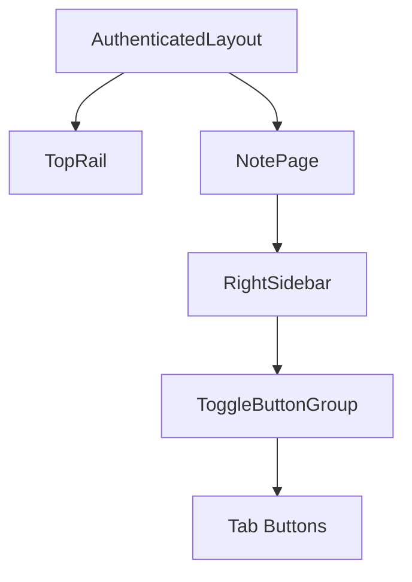

## Problem

On the Note page, the toggle buttons (Checklist, Tags, Audio, Time) at the top of the right sidebar are slightly clipped by the TopRail component above them. The buttons appear to be partially hidden/overlapped.

## Location

- **Page:** Note page (`/notes/:id`)
- **Component:** [`RightSidebar`](../../pages/NotePage/components/RightSidebar/RightSidebar.tsx)
- **Affected Elements:** ToggleButtonGroup containing tab buttons

## Current Architecture

**Key Components:**
- [`TopRail.tsx`](../../components/TopRail/TopRail.tsx) — Top navigation bar (36px height, `z-index: 10`)
- [`RightSidebar.tsx`](../../pages/NotePage/components/RightSidebar/RightSidebar.tsx) — Right panel with tab buttons
- [`RightSidebar.module.css`](../../pages/NotePage/components/RightSidebar/RightSidebar.module.css) — Styling

## Expected Behavior

Toggle buttons should be fully visible below the TopRail with appropriate spacing. No clipping or overlap should occur.

## Likely Cause

The RightSidebar component lacks sufficient `padding-top` or `margin-top` to account for the TopRail height. The TopRail has `z-index: 10` which may cause it to overlay the sidebar content.

## Files to Modify

| File | Change |
|------|--------|
| `frontend/src/pages/NotePage/components/RightSidebar/RightSidebar.module.css` | Add padding-top to `.sidebar` or `.content` |
| `frontend/src/pages/NotePage/components/RightSidebar/RightSidebar.tsx` | Optional: Adjust ToggleButtonGroup styling |

## Acceptance Criteria

1. [ ] Toggle buttons in right sidebar are fully visible
2. [ ] No overlap with TopRail component
3. [ ] Visual spacing matches design system
4. [ ] Works on desktop (mobile uses different layout)
5. [ ] Sidebar animation/transitions still function correctly

## Out of Scope

- Mobile layout changes (uses `MobileTagsView`)
- Changes to TopRail component itself
- Changes to button functionality or icons

## Resolution (Pending Review)

**Applied:** 2025-06-13

**Proposed Solution:** Added `padding-top: 8px` to `.sidebar` class in `RightSidebar.module.css` (reduced from 36px) to clear the TopRail without excess visual gap.

**Commit:** `24ffb7e` — fix: add padding to prevent right sidebar button clipping

**Needs Verification:**
- [ ] Buttons fully visible below TopRail
- [ ] No visual overlap or clipping  
- [ ] Spacing looks correct (not too large)
- [ ] Sidebar transitions still work

> **Note:** 36px might be too much padding. May need to reduce to ~8-12px depending on actual layout.
